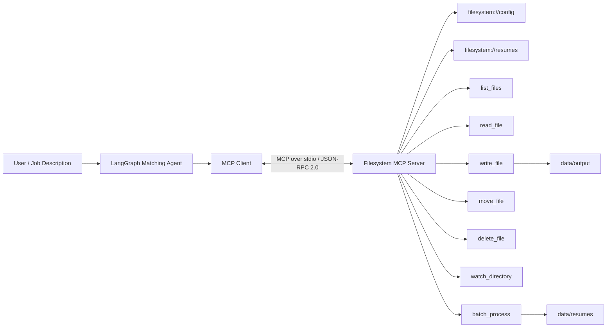

# MCP Resume Matching Agent

Airtribe Backend AI assignment project implementing:

- MCP filesystem server
- MCP resource discovery
- JSON-RPC 2.0-compliant MCP communication through the official SDK
- `watch_directory()`
- `batch_process()`
- LangGraph agent
- MCP client/server separation
- deterministic resume matching
- automated tests
- workflow diagram

## Architecture



## Project structure

```text
mcp_resume_matching_project/
├── filesystem_mcp_server.py
├── matching_agent.py
├── requirements.txt
├── README.md
├── .gitignore
├── .env.example
├── data/
│   ├── resumes/
│   │   ├── alice_backend.txt
│   │   ├── bob_data.txt
│   │   └── charlie_java.txt
│   └── output/
├── tests/
│   ├── test_matching.py
│   └── test_mcp_server.py
└── docs/
    ├── demo_script.md
    └── test_scenarios.md
```

## Why this satisfies the assignment

### Part A — MCP Server

The server uses the official MCP Python SDK. The SDK handles the MCP lifecycle and JSON-RPC 2.0 message framing while the application implements the filesystem capabilities.

Exposed tools:

1. `list_files`
2. `read_file`
3. `write_file`
4. `delete_file`
5. `move_file`
6. `watch_directory`
7. `batch_process`

Resources:

1. `filesystem://config`
2. `filesystem://resumes`

The two new capabilities required by the assignment are implemented:

- `watch_directory()` uses portable polling.
- `batch_process()` reads multiple resume files in one MCP call.

Path traversal is blocked by `_safe_path()`.

### Part B — Agent Refactoring

`matching_agent.py` never imports filesystem functions from the server.

Instead:

1. LangGraph agent starts the MCP server as a subprocess.
2. `ClientSession.initialize()` initializes MCP.
3. The agent discovers tools/resources.
4. The agent calls `batch_process()` through MCP.
5. LangGraph performs matching.
6. The final report is written by calling the MCP `write_file()` tool.

## Requirements

- Python 3.10+
- VS Code
- Internet access for installing Python packages
- Optional: Node.js/npm if you want to use MCP Inspector

## Windows + VS Code setup

### 1. Open the project

Extract the ZIP and open the folder in VS Code:

```powershell
cd mcp_resume_matching_project
code .
```

### 2. Create a virtual environment

PowerShell:

```powershell
py -3 -m venv .venv
.\.venv\Scripts\Activate.ps1
```

If PowerShell blocks activation, use Command Prompt:

```cmd
.venv\Scripts\activate.bat
```

### 3. Install packages

```powershell
python -m pip install --upgrade pip
pip install -r requirements.txt
```

### 4. Select the interpreter in VS Code

Press:

```text
Ctrl + Shift + P
```

Choose:

```text
Python: Select Interpreter
```

Select:

```text
.venv\Scripts\python.exe
```

## Run the MCP server

For the agent, use stdio:

```powershell
python filesystem_mcp_server.py
```

The terminal may appear to wait without showing normal application output. That is expected because stdio is the MCP transport.

Do not type normal commands into that terminal while the server is running.

## Test with MCP Inspector

The official MCP SDK provides `mcp dev`, which can launch an MCP Inspector for a FastMCP server.

From the project directory:

```powershell
python -m mcp dev filesystem_mcp_server.py
```

If your installed SDK exposes the `mcp` command directly:

```powershell
mcp dev filesystem_mcp_server.py
```

Open the Inspector URL printed by the command.

Check:

- Tools → `list_files`
- Tools → `batch_process`
- Tools → `watch_directory`
- Resources → `filesystem://config`
- Resources → `filesystem://resumes`

## Run the LangGraph agent

Open a second VS Code terminal, activate the same environment, and run:

```powershell
python matching_agent.py
```

You should see MCP discovery followed by ranked resumes.

A report is created here:

```text
data/output/matching_report.md
```

### Custom job description

You can provide another job description:

```powershell
python matching_agent.py --job "Python backend developer with SQL Docker Linux Git REST API"
```

## Run tests

```powershell
pytest -q
```

The tests cover:

- path traversal protection
- resume listing
- batch processing
- matching score calculation
- MCP in-process tool invocation
