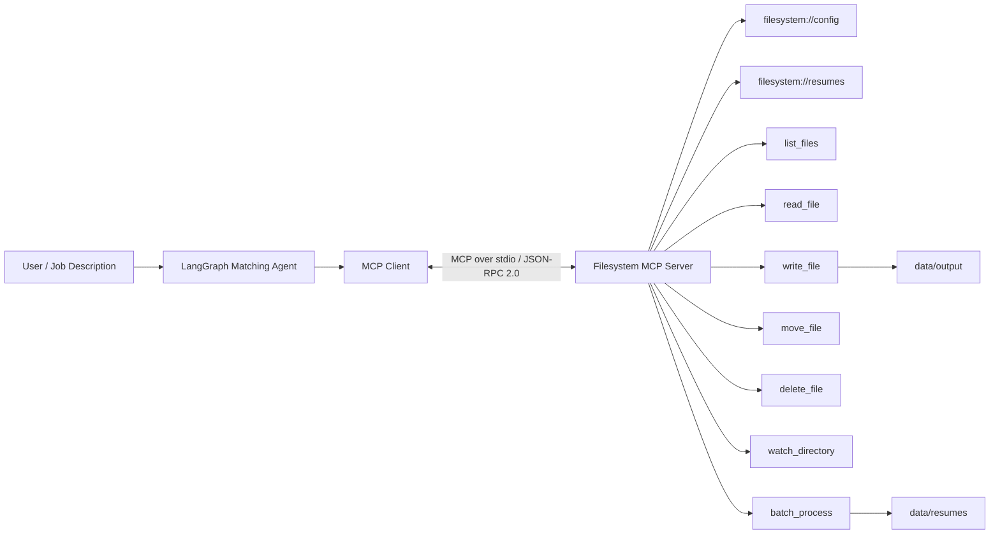

# MCP Resume Matching Agent

Airtribe Backend AI assignment project implementing:

- MCP filesystem server
- MCP resource discovery
- JSON-RPC 2.0-compliant MCP communication through the official SDK
- `watch_directory()`
- `batch_process()`
- LangGraph agent
- MCP client/server separation
- deterministic resume matching
- automated tests
- workflow diagram

## Architecture



## Project structure

```text
mcp_resume_matching_project/
├── filesystem_mcp_server.py
├── matching_agent.py
├── requirements.txt
├── README.md
├── .gitignore
├── .env.example
├── data/
│   ├── resumes/
│   │   ├── alice_backend.txt
│   │   ├── bob_data.txt
│   │   └── charlie_java.txt
│   └── output/
├── tests/
│   ├── test_matching.py
│   └── test_mcp_server.py
└── docs/
    ├── demo_script.md
    └── test_scenarios.md
```

## Why this satisfies the assignment

### Part A — MCP Server

The server uses the official MCP Python SDK. The SDK handles the MCP lifecycle and JSON-RPC 2.0 message framing while the application implements the filesystem capabilities.

Exposed tools:

1. `list_files`
2. `read_file`
3. `write_file`
4. `delete_file`
5. `move_file`
6. `watch_directory`
7. `batch_process`

Resources:

1. `filesystem://config`
2. `filesystem://resumes`

The two new capabilities required by the assignment are implemented:

- `watch_directory()` uses portable polling.
- `batch_process()` reads multiple resume files in one MCP call.

Path traversal is blocked by `_safe_path()`.

### Part B — Agent Refactoring

`matching_agent.py` never imports filesystem functions from the server.

Instead:

1. LangGraph agent starts the MCP server as a subprocess.
2. `ClientSession.initialize()` initializes MCP.
3. The agent discovers tools/resources.
4. The agent calls `batch_process()` through MCP.
5. LangGraph performs matching.
6. The final report is written by calling the MCP `write_file()` tool.

## Requirements

- Python 3.10+
- VS Code
- Internet access for installing Python packages
- Optional: Node.js/npm if you want to use MCP Inspector

## Windows + VS Code setup

### 1. Open the project

Extract the ZIP and open the folder in VS Code:

```powershell
cd mcp_resume_matching_project
code .
```

### 2. Create a virtual environment

PowerShell:

```powershell
py -3 -m venv .venv
.\.venv\Scripts\Activate.ps1
```

If PowerShell blocks activation, use Command Prompt:

```cmd
.venv\Scripts\activate.bat
```

### 3. Install packages

```powershell
python -m pip install --upgrade pip
pip install -r requirements.txt
```

### 4. Select the interpreter in VS Code

Press:

```text
Ctrl + Shift + P
```

Choose:

```text
Python: Select Interpreter
```

Select:

```text
.venv\Scripts\python.exe
```

## Run the MCP server

For the agent, use stdio:

```powershell
python filesystem_mcp_server.py
```

The terminal may appear to wait without showing normal application output. That is expected because stdio is the MCP transport.

Do not type normal commands into that terminal while the server is running.

## Test with MCP Inspector

The official MCP SDK provides `mcp dev`, which can launch an MCP Inspector for a FastMCP server.

From the project directory:

```powershell
python -m mcp dev filesystem_mcp_server.py
```

If your installed SDK exposes the `mcp` command directly:

```powershell
mcp dev filesystem_mcp_server.py
```

Open the Inspector URL printed by the command.

Check:

- Tools → `list_files`
- Tools → `batch_process`
- Tools → `watch_directory`
- Resources → `filesystem://config`
- Resources → `filesystem://resumes`

## Run the LangGraph agent

Open a second VS Code terminal, activate the same environment, and run:

```powershell
python matching_agent.py
```

You should see MCP discovery followed by ranked resumes.

A report is created here:

```text
data/output/matching_report.md
```

### Custom job description

You can provide another job description:

```powershell
python matching_agent.py --job "Python backend developer with SQL Docker Linux Git REST API"
```

## Run tests

```powershell
pytest -q
```

The tests cover:

- path traversal protection
- resume listing
- batch processing
- matching score calculation
- MCP in-process tool invocation

## Demonstrating watch_directory()

The watcher is easiest to demonstrate with a small Python command.

Terminal 1:

```powershell
python -c "from filesystem_mcp_server import watch_directory; print(watch_directory('resumes', 10, 1))"
```

However, because `watch_directory` is registered as an MCP tool and contains blocking polling, the cleanest demo is through MCP Inspector:

1. Open MCP Inspector.
2. Call `watch_directory`.
3. Use `directory=resumes`.
4. Set `duration_seconds=15`.
5. While it is waiting, create a new `.txt` file inside `data/resumes`.
6. The tool returns the newly detected file.

## Demonstrating batch_process()

Use MCP Inspector:

```text
Tool: batch_process
directory: resumes
pattern: *.txt
```

It returns all sample resumes in one structured response.

The LangGraph agent uses exactly this MCP capability to obtain the candidate set.

## Error handling

The server raises standard Python exceptions for invalid operations. The MCP SDK converts tool failures into protocol-level tool errors.

Examples:

- missing file → `FileNotFoundError`
- directory passed to `read_file` → `IsADirectoryError`
- path traversal → `ValueError`
- invalid watcher duration → `ValueError`

## Configuration

The default filesystem root is:

```text
./data
```

Override it with:

PowerShell:

```powershell
$env:RESUME_BASE_DIR="C:\path\to\your\data"
python filesystem_mcp_server.py
```

The `filesystem://config` resource exposes the active configuration.

## Demo sequence — 5 to 6 minutes

### 0:00–0:45 — Explain MCP

Say:

> MCP standardizes how an AI application discovers and calls external capabilities. Instead of embedding filesystem functions inside the agent, the filesystem is exposed as an independent MCP server.

### 0:45–1:45 — Show server

Open `filesystem_mcp_server.py`.

Show:

- `FastMCP("ResumeFileSystem")`
- resources
- filesystem tools
- `watch_directory`
- `batch_process`
- path safety

### 1:45–2:30 — Show Inspector

Run:

```powershell
python -m mcp dev filesystem_mcp_server.py
```

Show resource discovery and tool discovery.

Call `batch_process`.

### 2:30–3:45 — Show agent

Open `matching_agent.py`.

Explain:

> The agent starts the MCP server through stdio and creates a ClientSession. It discovers the available MCP tools/resources, calls batch_process, and passes the result into a LangGraph workflow.

Show `build_graph()`.

### 3:45–4:45 — Run end-to-end

Run:

```powershell
python matching_agent.py
```

Show:

- MCP tools
- MCP resources
- ranked candidates
- generated report

### 4:45–5:30 — Tests

Run:

```powershell
pytest -q
```

Show passing tests.

### 5:30–6:00 — Architecture

Show the Mermaid workflow in `README.md` and explain:

```text
User
 ↓
LangGraph Agent
 ↓
MCP Client
 ↓
MCP Server
 ↓
Filesystem
```

## Important note for your submission

The assignment says "Expose all Milestone 1 tools". Since the exact Milestone 1 source files were not included with this brief, this project provides a complete baseline filesystem tool set. If your Milestone 1 had additional tool names/functions, copy those exact functions into the MCP server and decorate them with `@mcp.tool()` so your submission preserves the original functionality.

## Production-readiness improvements you can mention

For a production deployment, discuss:

- authentication/authorization
- audit logging
- structured logging
- configurable allowed directories
- file size limits
- MIME/type validation
- non-blocking filesystem watching
- persistent job queues for very large batches
- containerization
- health/metrics endpoints
- rate limiting
- secret management

Do not claim these are implemented unless you add them.

## Official MCP references

The current official Python SDK documentation is available from the Model Context Protocol project. It supports MCP servers/clients and standard transports including stdio and Streamable HTTP.
